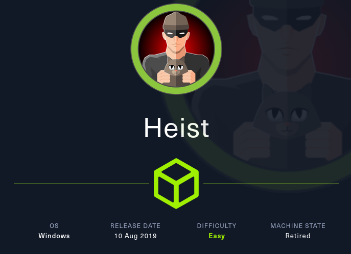
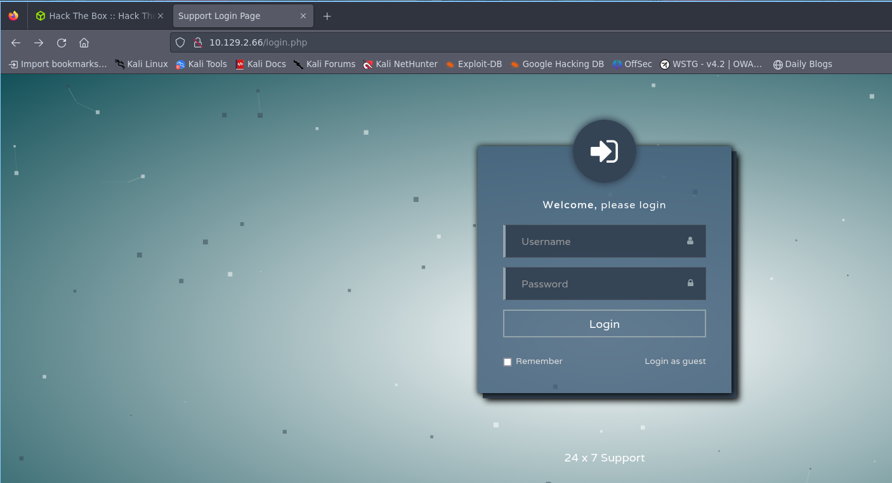
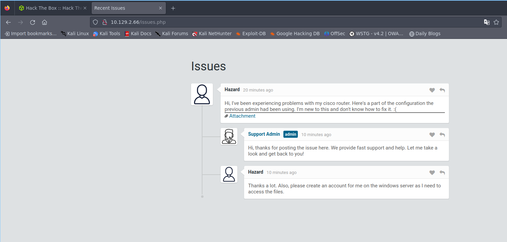
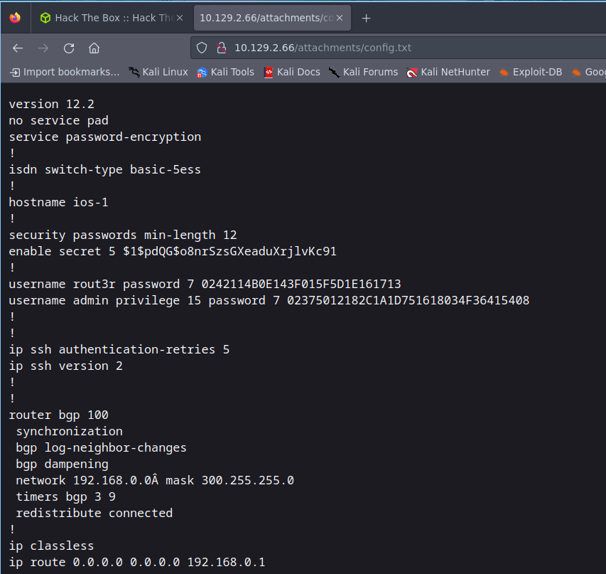
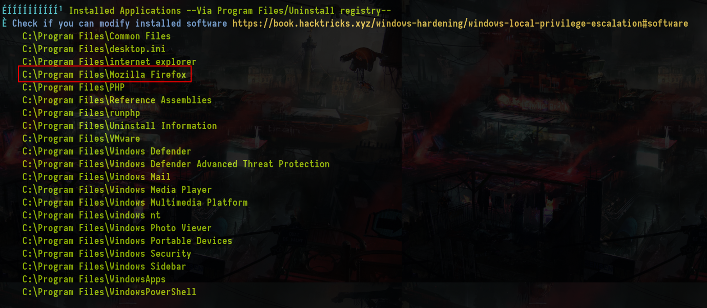
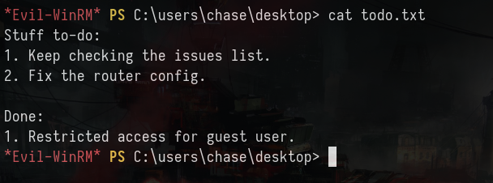
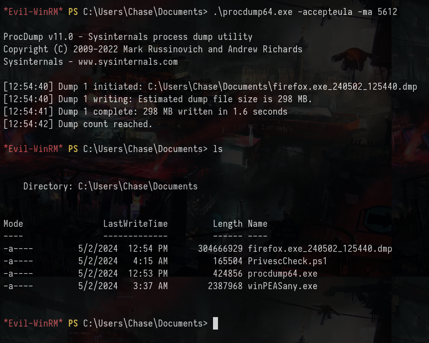

# HTB - Heist



## TL;DR

Regarde le site sous le port 80 et retrouver un formulaire de connexion sur lequel on peut s'authentifié en tant qu'invité, lire les conversations entre l'utilisateur `Hazard` et `Support Admin` et retrouver un fichier `attachment.txt` qui contient la configuration d'un routeur Cisco avec plusieurs hashs. Cracker les hashs et retrouver trois mots de passe, utiliser netexec pour password spraying et retrouver le couple `hazard:stealth1agent`.  

Toujours avec netxec, réaliser un bruteforce RID pour extraire les utilisateurs du domaine et les mettre dans une wordlist pour password spraying à nouveau. Cette fois on retrouve le couple `Chase:Q4)sJu\Y8qz*A3?d`.  

Exécuter winPEAS pour voir qu'il y a le logiciel `Firefox` installé sur la machine, faire un audit du code source du formulaire `login.php` et réaliser que les credentials sont codés en dur dans l'application. Regarder les processus en lien avec firefox et utiliser `Procdump` de la suite Sysinternals pour dump la mémoire du processus, transfert du dump sur la machine d'attaque et utiliser `strings` sur `login_password` pour retrouver le mot de passe de l'administrateur. On peut se connecter avec le couple `Administrator:4dD!5}x/re8]FBuZ` via evil-winrm.

## Reconnaissance

### Nmap TCP base

```
sudo nmap -sCV -p80,135,445 -T4 -oN nmap_base_script -Pn --min-rate 10000 10.129.2.66 -v

PORT    STATE SERVICE       VERSION
80/tcp  open  http          Microsoft IIS httpd 10.0
| http-title: Support Login Page
|_Requested resource was login.php
| http-methods:
|   Supported Methods: OPTIONS TRACE GET HEAD POST
|_  Potentially risky methods: TRACE
| http-cookie-flags:
|   /:
|     PHPSESSID:
|_      httponly flag not set
|_http-server-header: Microsoft-IIS/10.0
135/tcp open  msrpc         Microsoft Windows RPC
445/tcp open  microsoft-ds?
Service Info: OS: Windows; CPE: cpe:/o:microsoft:windows
```

### Nmap TCP full

```
sudo nmap -sV -p- -T4 -oN nmap_full --min-rate 10000 10.129.2.66 -v

PORT      STATE SERVICE       VERSION
80/tcp    open  http          Microsoft IIS httpd 10.0
135/tcp   open  msrpc         Microsoft Windows RPC
445/tcp   open  microsoft-ds?
5985/tcp  open  http          Microsoft HTTPAPI httpd 2.0 (SSDP/UPnP)
49669/tcp open  msrpc         Microsoft Windows RPC
Service Info: OS: Windows; CPE: cpe:/o:microsoft:windows
```

Il y a le port WinRM d'ouvert, ce qui peut être intéressant dès que l'on a des creds.

## Enumération

### Port 80/tcp - HTTP

Sur le site, on retrouve un formulaire de connexion avec la possibilité de se connecter en tant que Guest



On arrive sur une page de chat et on retrouve l'utilisateur `Hazard` qui remonte un souci avec un routeur Cisco avec un fichier de configuration en pièce-jointe. A la fin, le même utilisateur demande de créer un compte sur le serveur Windows pour accéder aux fichiers. On peut supposer que ce sera notre foothold.



Si on regarde le fichier, il s'agit bien d'un fichier de conf classique Cisco et l'on retrouve un hash md5crypt que l'on peut tenter de crack.



`john --format=md5crypt hash.txt --wordlist=../../../intuition/rockyou.txt`


Ca fonctionne et on retrouve `stealth1agent`. Si on check avec netexec si les creds sont valides, ça passe. On peut voir également que l'on est sur le domaine `SupportDesk`.

`netexec smb 10.129.2.66 -u hazard -p stealth1agent`


Tentative de connexion avec evil-winrm, mais ça ne passe pas. On va tenter d'utiliser les creds pour se connecter à partir du formulaire sur le site. Utilisation d'rid-brute pour énumérer les utilisateurs du domaine

`netexec smb 10.129.2.66 -u hazard -p stealth1agent --rid-brute`


On retrouve cinq utilisateurs


Tentative de password spraying avec la wordlist de users + le mdp cracké, mais ça ne donne rien. Pareil pour `username=mdp`


## Première connexion - Chase

Le fuzzing des répertoires ne donne rien de plus. Si on revient sur notre fichier de configuration Cisco, on retrouve d'autres hashs que l'on peut tenter de cracker également avec l'aide de ce [site](https://www.firewall.cx/cisco/cisco-routers/cisco-type7-password-crack.html). Ca fonctionne et on retrouve le mot de passe `Q4)sJu\Y8qz*A3?d`. Ainsi que l'autre `$uperP@ssword`


Si on password spray avec notre liste d'utilisateur et les deux mots de passe, on retrouve le mot de passe valide `Q4)sJu\Y8qz*A3?d` pour l'utilisateur Chase.


`netexec smb 10.129.2.66 -u users.lst -p 'Q4)sJu\Y8qz*A3?d' --continue-on-success`

Tentative de connexion avec evil-winrm

`evil-winrm -u 'Chase' -p 'Q4)sJu\Y8qz*A3?d' -i 10.129.2.66`

Ca fonctionne et on peut récupérer le premier flag


## Elévation de privilèges - Administrator

Lancement de winPEAS, mais ça ne donne rien sauf qu'on peut voir que le logiciel firefox est installé sur la machine et ce n'est pas installé par défaut sous Windows.



Dans les utilisateurs, on retrouve `Hazard` qui pourrait être notre pivot.


Sous `C:\inetpub\wwwroot\` on peut lire le code source du formulaire de login `login.php` et on voit que les credentials ont été codés en dûr notamment :
- login_username = `admin@support.htb`
- login_password = `91c077fb5bcdd1eacf7268c945bc1d1ce2faf9634cba615337adbf0af4db9040` (sha256)


On peut essayer de cracker le hash, mais ça ne donne rien. Dans le répertoire home de `Chase` sous `C:\users\chase\desktop`, on peut voir un fichier `todo.txt` et notamment le point un semble indiquer à l'utilisateur de continuer à check la liste des problèmes.



On peut supposer qu'il se connecte régulièrement sur le site, peut-être que l'on peut récupérer le `login_password` directement.
Analyse des processus sur la machine avec `get-process`


Il y a plusieurs processus firefox en cours. Avec l'aide de cet [article](https://book.hacktricks.xyz/windows-hardening/windows-local-privilege-escalation#memory-password-mining), on peut tenter de créer un dump mémoire du process en utilisant `procdump` de la suite sysinternals pour voir si on peut retrouver les credentials en cleartext.

`.\procdump64.exe -accepteula -ma 5612`



Transfert du dump sur la machine d'attaque (c'est loooong). Maintenant on peut utiliser le binaire strings pour faire une recherche sur `login_password`

`strings firefox_exe_240502_125440 | grep -i "login_password"`


Ca fonctionne et on retrouve le mot de passe `4dD!5}x/re8]FBuZ`, tentative de connexion avec evil-winrm et récupération du dernier flag

`evil-winrm -u 'Administrator' -p '4dD!5}x/re8]FBuZ' -i 10.129.2.66`


